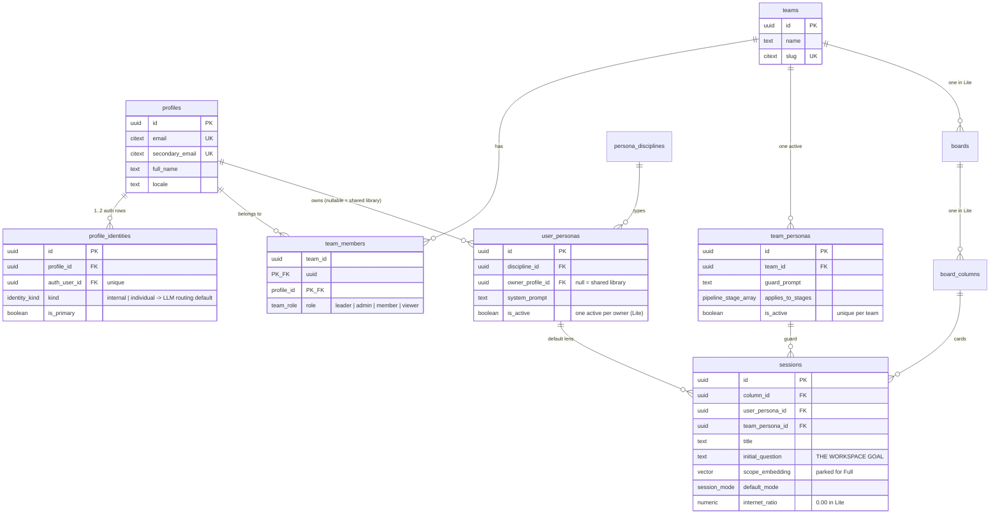

# 07 — Database Architecture (ThinkBoard Lite)

> **Why this document exists.** The frontend is built first, so the schema is the *contract* it builds
> against. Every screen in Lite reads and writes real Supabase rows through RLS from day one — there is no
> mock layer and no backend to wait for. This file is what makes that possible: it says which tables exist,
> which are active in Lite, who may write them, and which of them mirror into the local Dexie store.
>
> Source of truth for shape stays `thinkboard-schema-final.sql`. This document adds the Lite delta, the
> access map, and the ERDs.

---

## 1. Three rules that shape everything below

| # | Rule | Consequence |
|---|---|---|
| **DB-1** | **No service-role key in Lite.** Every client query runs under the user's JWT. | RLS is not a safety net, it *is* the authorization layer. A missing policy is a broken feature, not a leak waiting to happen. |
| **DB-2** | **The client writes CRUD directly; the server writes only what it computes.** | Four server endpoints exist. Everything else is `supabase.from(...)` under RLS, which is why the frontend can go first. |
| **DB-3** | **Postgres is the server of record; Dexie is the client's copy.** | Every client-written table needs `updated_at` so reconnect reconciliation can diff a manifest. |

---

## 2. Scope map — what is live in Lite

The schema is Full's. Lite uses a subset and leaves the rest in place, unused, so Full turns on without a
migration.

| Cluster | Table | Lite | Written by |
|---|---|---|---|
| **Identity** | `profiles` | ✅ active | trigger from `auth.users` |
| | `profile_identities` | ✅ active | trigger; `kind` drives LLM routing default |
| | `teams` | ✅ active | client (workspace create RPC) |
| | `team_members` | ✅ active | client; `role='leader'` chosen by the creator |
| **Personas** | `persona_disciplines` | ✅ read-only | seed |
| | `user_personas` | ✅ active | client (own rows) |
| | `team_personas` | ✅ active | client (leader only) |
| **Workspace** | `boards` | ✅ active, hidden in UI | client, 1 per team |
| | `board_columns` | ✅ active, hidden in UI | client, 1 per board |
| | `sessions` | ✅ active — **this is the workspace** | client |
| | `messages` | ⏸ parked | — (Lite has no chat pane) |
| | `context_warnings` | ⏸ parked | — (the PDF is the scope anchor) |
| **Document** | `artifacts` | ✅ active | client (metadata); Storage holds bytes |
| | `highlights` | ✅ active ★ | **client** — the hottest table in the app |
| | `highlight_notes` | ✅ **new in Lite** ★ | **client** |
| | `mini_conclusions` | ✅ active | server (command 2) |
| | `highlight_term_weights` | ✅ active | client, batched |
| **Memory** | `memory_entries` | ✅ scopes `group` + `initial` only | client (leader for `group`) |
| **Pipeline** | `pipeline_runs` | ✅ active | server (command 3) |
| | `pipeline_stages` | ✅ 3 of 7 stage values | server |
| | `points` | ✅ active | server |
| | `point_conclusions` | ✅ active | server |
| | `run_renderings` | ✅ `descriptive` + `visualize` | server |
| **Sources** | `sources`, `point_sources` | ⏸ parked | — (no RAG in Lite) |
| **LLM** | `llm_providers`, `llm_models` | ✅ read-only | seed/config |
| | `user_llm_keys` | ✅ active | client writes the row, **server alone resolves the Vault secret** |
| | `llm_requests` | ✅ active | server; client may `insert` its own |

★ = mirrored into Dexie. See §6.

---

## 3. ERD — Identity and workspace



**The workspace is four rows, created together.** `teams → boards → board_columns → sessions`, one each, in
a single transaction. The board layer is invisible in Lite's UI and exists so Full's kanban turns on with
no migration. Existing unique indexes do real work here: `team_members_one_leader` enforces one leader,
`team_personas_one_active` enforces one workspace persona.

---

## 4. ERD — Document, highlights, notes (the core)

This is where Lite actually lives. Everything here is client-written under RLS.

```mermaid
erDiagram
    sessions   ||--o{ artifacts        : "main + note slots"
    artifacts  ||--o{ highlights       : "focus points"
    highlights ||--o{ highlight_notes  : "evidence"
    highlights ||--o| mini_conclusions : "1:1, server-written"
    profiles   ||--o{ highlights       : "author"
    profiles   ||--o{ highlight_notes  : "author"
    profiles   ||--o{ highlight_term_weights : "per-user boost"
    sessions   ||--o{ memory_entries   : "group notulen + initial goal"

    artifacts {
        uuid id PK
        uuid session_id FK
        artifact_kind kind "pdf"
        artifact_slot slot "main | note (unique per session)"
        text storage_path "Supabase Storage"
        int page_count
    }
    highlights {
        uuid id PK "client-generated uuidv7"
        uuid artifact_id FK
        uuid profile_id FK "author"
        int page
        jsonb bbox "normalized 0-1 rects, colour, tool"
        text text "exact string or OCR output"
        text slug "h-pNN-NN-xxxxxx -- traceable to md + PDF"
        highlight_layer layer "individual | group"
        timestamptz shared_at "null = private; set = promoted"
        extraction_kind extraction "text_layer | ocr"
        numeric confidence "OCR gate at 0.70"
        numeric weight
        timestamptz updated_at "REQUIRED for reconcile"
    }
    highlight_notes {
        uuid id PK "client-generated uuidv7"
        uuid highlight_id FK
        uuid profile_id FK
        note_visibility visibility "individual | group"
        note_input_mode input_mode "keyboard | stylus_os | ink"
        text content "the note text"
        jsonb ink "strokes -- only when input_mode = ink"
        text transcribed_by "os | local | model | null"
        int version "optimistic concurrency"
        timestamptz updated_at
    }
    mini_conclusions {
        uuid id PK
        uuid highlight_id FK "unique"
        text content
    }
    memory_entries {
        uuid id PK
        memory_scope scope "group | initial in Lite"
        uuid session_id FK
        uuid team_id FK
        memory_kind kind "idea | limitation"
        text content
    }
    highlight_term_weights {
        uuid profile_id PK_FK
        citext term PK
        numeric weight
        int hit_count
    }
```

### 4.1 The three visibility states

| `layer` | `shared_at` | Who can `select` | Who can write |
|---|---|---|---|
| `individual` | `null` | the author only | the author |
| `individual` | set | everyone in the workspace | still the author |
| `group` | — | everyone in the workspace | the leader only |

Promotion is the author's act, atomic over the highlight and its note, via the `promote_highlight()`
`security invoker` RPC. The Group Result reads `layer = 'group' OR shared_at IS NOT NULL`.

### 4.2 `bbox` carries all geometry — deliberately

No `x/y/w/h` columns, no `colour` column. `bbox` is
`{ page, rects: [{x,y,w,h}…], color, tool }` with **normalized page-relative values in 0–1**. Viewport
pixels in this column is the bug that only shows up after someone zooms, weeks later, on another tablet.

### 4.3 `updated_at` is not optional

`highlights` and `highlight_notes` both carry it with a touch trigger. Reconnect reconciliation diffs a
manifest (`select id, updated_at`) — and a manifest diff is the only thing that catches **deletes**, which
an `updated_at > lastSynced` query never will.

---

## 5. ERD — Results and LLM

Everything here is server-written. The frontend reads it and never writes it.


**`owner_profile_id` is the whole individual/group split.** `NULL` = the group result; set = that member's
private result. One nullable column, and Full's existing behaviour is the `NULL` case.

**Temperature is computed, not generated.** With no Research/Validation/Questioning stage in Lite, a
model-emitted confidence number is decoration. The formula counts backers, corroborating authors,
recorded limitations and text-layer-vs-OCR, and stores unchanged in the existing `numeric(3,2)` column.

---

## 6. The frontend data contract

This table is what lets frontend work start before any backend exists.

| Table | Client read | Client write | Dexie mirror | Notes |
|---|---|---|---|---|
| `profiles`, `profile_identities` | ✅ own | trigger | `meta` | identity kind → LLM default |
| `teams`, `team_members` | ✅ member | ✅ create/transfer | — | queried live, small |
| `team_personas`, `user_personas` | ✅ | ✅ (leader / own) | `meta` | |
| `sessions` | ✅ member | ✅ | `meta` | the workspace row |
| `artifacts` | ✅ member | ✅ metadata | ✅ `artifacts` | bytes → OPFS + Storage |
| **`highlights`** | ✅ per §4.1 | ✅ | ✅ `highlights` | the hot path |
| **`highlight_notes`** | ✅ own + group | ✅ own | ✅ `notes` | |
| `mini_conclusions` | ✅ | ❌ server | ✅ `miniConclusions` | |
| `memory_entries` | ✅ group/initial | ✅ leader | — | notulen, low volume |
| `pipeline_runs` … `run_renderings` | ✅ | ❌ server | ✅ `runs` (read cache) | |
| `llm_providers`, `llm_models` | ✅ | ❌ | — | populate a settings dropdown |
| `user_llm_keys` | ✅ own | ✅ own row | — | never the secret |
| `llm_requests` | ✅ own | ✅ insert own | — | usage banner |

**Build order this implies:** schema → RLS → generated types → frontend. Tasks 001–003 in
`07-whole-apps-task.md` exist exactly to unblock task 008 onward.

### 6.1 Dexie mirror, and the one rule about it

```ts
new Dexie(`thinkboard:${profileId}`)          // per-profile — shared tablets are real
db.version(1).stores({
  meta:            "key",
  artifacts:       "id, sessionId",
  highlights:      "id, [artifactId+page], layer, _dirty",
  notes:           "id, highlightId, profileId, _dirty",
  miniConclusions: "highlightId",
  runs:            "id, sessionId, ownerProfileId",
  outbox:          "++seq, rowId, table",
})
```

Local-only fields (`_dirty`, `seq`) **never cross into a Postgres write**. The `toWire()` mapper is the
only place the two shapes meet, and its key set should be asserted against the column list in a test.

---

## 7. Migration order

| File | Contents | Status |
|---|---|---|
| `0001_initial.sql` | full consolidated Full schema — enums, tables, RLS, seed personas | exists |
| `0002_auth_trigger.sql` | `auth.users` → `profiles` / `profile_identities` | exists |
| `0003_grant_schema.sql` | restores `anon` / `authenticated` / `service_role` grants | exists |
| **`0004_lite.sql`** | the Lite delta — §8 | **task 001** |

`0004_lite.sql` is: three enums, one new table, six columns, one helper function, one RPC, two touch
triggers, two broadcast triggers, two `realtime.messages` policies, one persona index — and **two policies
dropped and recreated**, which is the only non-additive change in the whole plan.

---

## 8. The Lite delta, summarised

Full SQL lives in `06-thinkboard-lite.md` §6 and v2's §5 addendum. What it does, and why each piece:

| Change | Why |
|---|---|
| `note_visibility`, `note_input_mode`, `highlight_layer` enums | the three-state visibility model and the input tabs |
| `highlight_notes` table | the one genuinely new table — notes attached to a focus point |
| `highlights.layer`, `.shared_at` | private / promoted / group |
| `highlights.slug` | traceable from DB row → `notes.md` anchor → PDF `/NM` |
| `highlights.updated_at` + touch trigger | reconnect reconciliation has nothing to diff without it |
| `highlight_notes.transcribed_by` | tells you months later whether OS handwriting carried the load |
| `points.highlight_id` | trace a conclusion back to the mark it came from |
| `pipeline_runs.owner_profile_id` | individual vs group result |
| `can_lead_session()` | the leader check RLS needs, once |
| `promote_highlight()` RPC, `security invoker` | sharing a highlight and its note can never half-succeed |
| **drop + recreate** `"artifact highlights"` and `"highlight conclusions"` | the existing policies are workspace-wide, so private highlights are impossible until they are replaced — and the `mini_conclusions` policy would otherwise expose the conclusion of a highlight that stays hidden |
| two broadcast triggers choosing `ws:{sessionId}` vs `user:{profileId}` | a broadcast payload is only as private as its topic |
| two `realtime.messages` policies | authorises listening to each topic |
| `user_personas_one_active_per_owner` | Lite's one-active-persona convention |
| `llm_requests` insert policy | the client-JWT path records its own usage |

---

## 9. The test that must exist before any feature is built

In task 002, not later:

```
Sign in as member B.
  1. B cannot select A's private highlight.                        → 0 rows
  2. B cannot select the mini_conclusion of A's private highlight. → 0 rows
  3. B cannot insert a row with layer='group'.                     → RLS denial
  4. B DOES receive A's promoted highlight over ws:{sessionId}.    → broadcast arrives
  5. B does NOT receive A's private highlight on any topic.        → nothing arrives
  6. The leader can insert layer='group'.                          → succeeds
```

Checks 2 and 5 are the ones that never show up in manual testing and are the reason the RLS rewrite is
flagged as the highest-risk item in the plan.

---

## 10. Open questions

| # | Question | Default |
|---|---|---|
| DB-Q1 | Is "individual" a privacy boundary? | **yes** — drives the whole §4.1 model |
| DB-Q2 | One PDF per workspace? | one `main` + the leader's imported `note` copy |
| DB-Q3 | Per-profile Dexie namespace? | **yes** — shared tablets are real |
| DB-Q4 | Keep `messages`, `context_warnings`, `sources` parked, or drop them from Lite's migration? | **keep parked** — they cost nothing and Full needs them |
| DB-Q5 | Does the Lite task backlog replace `02-working.md` §8? | yes, proposed — see `07-whole-apps-task.md` |
