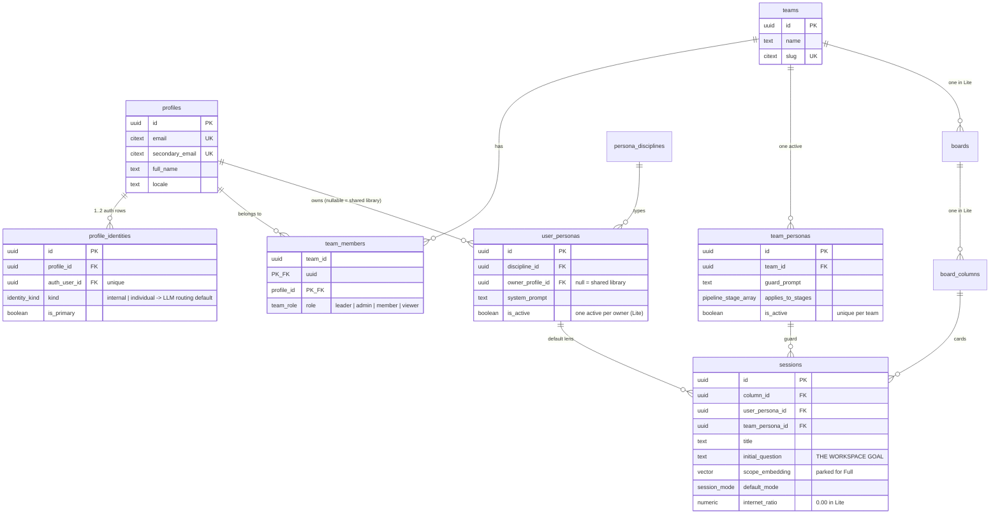
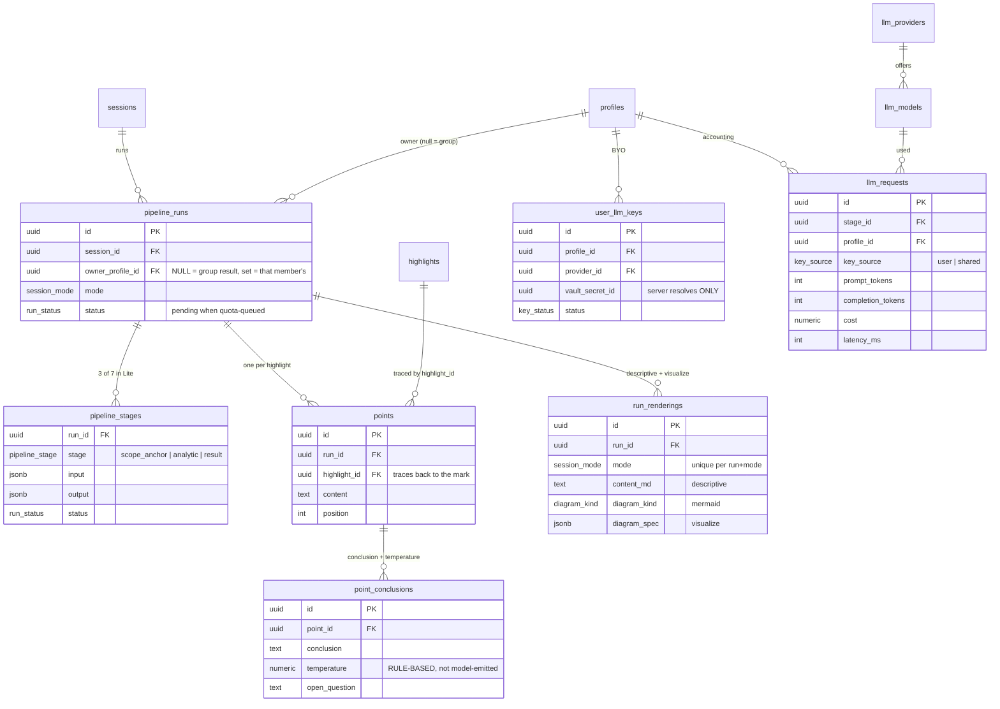

> **rev 1.1 (2026-09-18).** Reviewed against every plan doc. §8.1 is now the one, final `0004_lite.sql`,
> with C6 and the ten review fixes in §11 applied. Implement from §8.1, not from 06 §6.

# 07 — Database Architecture (ThinkBoard Lite)

> **Why this document exists.** The frontend is built first, so the schema is the *contract* it builds
> against. Every screen in Lite reads and writes real Supabase rows through RLS from day one — there is no
> mock layer and no backend to wait for. This file is what makes that possible: it says which tables exist,
> which are active in Lite, who may write them, and which of them mirror into the local Dexie store.
>
> Source of truth for shape stays `thinkboard-schema-final.sql`. This document adds the Lite delta, the
> access map, and the ERDs.

---

## 1. Three rules that shape everything below

| # | Rule | Consequence |
|---|---|---|
| **DB-1** | **No service-role key in Lite.** Every client query runs under the user's JWT. | RLS is not a safety net, it *is* the authorization layer. A missing policy is a broken feature, not a leak waiting to happen. |
| **DB-2** | **The client writes CRUD directly; the server writes only what it computes.** | Four server endpoints exist. Everything else is `supabase.from(...)` under RLS, which is why the frontend can go first. |
| **DB-3** | **Postgres is the server of record; Dexie is the client's copy.** | Every client-written table needs `updated_at` so reconnect reconciliation can diff a manifest. |

---

## 2. Scope map — what is live in Lite

The schema is Full's. Lite uses a subset and leaves the rest in place, unused, so Full turns on without a
migration.

| Cluster | Table | Lite | Written by |
|---|---|---|---|
| **Identity** | `profiles` | ✅ active | trigger from `auth.users` |
| | `profile_identities` | ✅ active | trigger; `kind` drives LLM routing default |
| | `teams` | ✅ active | client (workspace create RPC) |
| | `team_members` | ✅ active | client; `role='leader'` chosen by the creator |
| **Personas** | `persona_disciplines` | ✅ read-only | seed |
| | `user_personas` | ✅ active | client (own rows) |
| | `team_personas` | ✅ active | client (leader only) |
| **Workspace** | `boards` | ✅ active, hidden in UI | client, 1 per team |
| | `board_columns` | ✅ active, hidden in UI | client, 1 per board |
| | `sessions` | ✅ active — **this is the workspace** | client |
| | `messages` | ⏸ parked | — (Lite has no chat pane) |
| | `context_warnings` | ⏸ parked | — (the PDF is the scope anchor) |
| **Document** | `artifacts` | ✅ active | client (metadata); Storage holds bytes |
| | `highlights` | ✅ active ★ | **client** — the hottest table in the app |
| | `highlight_notes` | ✅ **new in Lite** ★ | **client** |
| | `mini_conclusions` | ✅ active | server (command 2) |
| | `highlight_term_weights` | ✅ active | client, batched |
| **Memory** | `memory_entries` | ✅ scopes `group` + `initial` only | client (leader for `group`) |
| **Pipeline** | `pipeline_runs` | ✅ active | server (command 3) |
| | `pipeline_stages` | ✅ 3 of 7 stage values | server |
| | `points` | ✅ active | server |
| | `point_conclusions` | ✅ active | server |
| | `run_renderings` | ✅ `descriptive` + `visualize` | server |
| **Sources** | `sources`, `point_sources` | ⏸ parked | — (no RAG in Lite) |
| **LLM** | `llm_providers`, `llm_models` | ✅ read-only | seed/config |
| | `user_llm_keys` | ✅ active | client writes the row, **server alone resolves the Vault secret** |
| | `llm_requests` | ✅ active | server; client may `insert` its own |

★ = mirrored into Dexie. See §6.

---

## 3. ERD — Identity and workspace



**The workspace is four rows, created together.** `teams → boards → board_columns → sessions`, one each, in
a single transaction. The board layer is invisible in Lite's UI and exists so Full's kanban turns on with
no migration. Existing unique indexes do real work here: `team_members_one_leader` enforces one leader,
`team_personas_one_active` enforces one workspace persona.

---

## 4. ERD — Document, highlights, notes (the core)

This is where Lite actually lives. Everything here is client-written under RLS.

```mermaid
erDiagram
    sessions   ||--o{ artifacts        : "main + note slots"
    artifacts  ||--o{ highlights       : "focus points"
    highlights ||--o{ highlight_notes  : "evidence"
    highlights ||--o| mini_conclusions : "1:1, server-written"
    profiles   ||--o{ highlights       : "author"
    profiles   ||--o{ highlight_notes  : "author"
    profiles   ||--o{ highlight_term_weights : "per-user boost"
    sessions   ||--o{ memory_entries   : "group notulen + initial goal"

    artifacts {
        uuid id PK
        uuid session_id FK
        artifact_kind kind "pdf"
        artifact_slot slot "main | note (unique per session)"
        text storage_path "Supabase Storage"
        int page_count
    }
    highlights {
        uuid id PK "client-generated uuidv7"
        uuid artifact_id FK
        uuid profile_id FK "author"
        int page
        jsonb bbox "normalized 0-1 rects, colour, tool"
        text text "exact string or OCR output"
        text slug "h-pNN-NN-xxxxxx -- traceable to md + PDF"
        highlight_layer layer "individual | group"
        timestamptz shared_at "null = private; set = promoted"
        extraction_kind extraction "text_layer | ocr"
        numeric confidence "OCR gate at 0.70"
        numeric weight
        timestamptz updated_at "REQUIRED for reconcile"
    }
    highlight_notes {
        uuid id PK "client-generated uuidv7"
        uuid highlight_id FK
        uuid profile_id FK
        note_visibility visibility "individual | group"
        note_input_mode input_mode "keyboard | stylus_os | ink"
        text content "the note text"
        jsonb ink "strokes -- only when input_mode = ink"
        timestamptz transcribed_at "null = not yet tried"
        text transcribed_by "os | local | model | null"
        int version "optimistic concurrency"
        timestamptz updated_at
    }
    mini_conclusions {
        uuid id PK
        uuid highlight_id FK "unique"
        text content
    }
    memory_entries {
        uuid id PK
        memory_scope scope "group | initial in Lite"
        uuid session_id FK
        uuid team_id FK
        memory_kind kind "idea | limitation"
        text content
    }
    highlight_term_weights {
        uuid profile_id PK_FK
        citext term PK
        numeric weight
        int hit_count
    }
```

### 4.1 The three visibility states

| `layer` | `shared_at` | Who can `select` | Who can write |
|---|---|---|---|
| `individual` | `null` | the author only | the author |
| `individual` | set | everyone in the workspace | still the author |
| `group` | — | everyone in the workspace | the leader only |

Promotion is the author's act, atomic over the highlight and its note, via the `promote_highlight()`
`security invoker` RPC. The Group Result reads `layer = 'group' OR shared_at IS NOT NULL`.

### 4.2 `bbox` carries all geometry — deliberately

No `x/y/w/h` columns, no `colour` column. `bbox` is
`{ page, rects: [{x,y,w,h}…], color, tool }` with **normalized page-relative values in 0–1**. Viewport
pixels in this column is the bug that only shows up after someone zooms, weeks later, on another tablet.

### 4.3 `updated_at` is not optional

`highlights` and `highlight_notes` both carry it with a touch trigger. Reconnect reconciliation diffs a
manifest (`select id, updated_at`) — and a manifest diff is the only thing that catches **deletes**, which
an `updated_at > lastSynced` query never will.

---

## 5. ERD — Results and LLM

Everything here is server-written. The frontend reads it and never writes it.



**`owner_profile_id` is the whole individual/group split.** `NULL` = the group result; set = that member's
private result. One nullable column, and Full's existing behaviour is the `NULL` case. Because `NULL` means
*group*, the foreign key is `on delete cascade`, never `set null` — deleting a profile must not publish its
private results (DB-F9).

**"Server-written" is a convention, not a boundary.** Under DB-1 the server holds the requester's JWT, so RLS
decides *who* may write a run, never *which process* did. The run-cluster policies in §8.1 therefore say
who: your own individual run, or the group run if you lead (D-03).

**Temperature is computed, not generated.** With no Research/Validation/Questioning stage in Lite, a
model-emitted confidence number is decoration. The formula counts backers, corroborating authors,
recorded limitations and text-layer-vs-OCR, and stores unchanged in the existing `numeric(3,2)` column.

---

## 6. The frontend data contract

This table is what lets frontend work start before any backend exists.

| Table | Client read | Client write | Dexie mirror | Notes |
|---|---|---|---|---|
| `profiles`, `profile_identities` | ✅ own | trigger | `meta` | identity kind → LLM default |
| `teams`, `team_members` | ✅ member | ✅ create/transfer | — ⚠️ DB-Q12 | "queried live" has no legal home under RULE-07 / I15 / I21 |
| `team_personas`, `user_personas` | ✅ | ✅ (leader / own) | `meta` | |
| `sessions` | ✅ member | ✅ | `meta` | the workspace row |
| `artifacts` | ✅ member | ✅ metadata | ✅ `artifacts` | bytes → OPFS + Storage |
| **`highlights`** | ✅ per §4.1 | ✅ | ✅ `highlights` | the hot path |
| **`highlight_notes`** | ✅ own + group | ✅ own | ✅ `notes` | |
| `mini_conclusions` | ✅ | ❌ server | ✅ `miniConclusions` | |
| `memory_entries` | ✅ group/initial | ✅ leader | — | notulen, low volume |
| `pipeline_runs` … `run_renderings` | ✅ group + own | ❌ server (convention — §5) | ✅ `runs` (read cache) | individual runs are private (DB-F6) |
| `llm_providers`, `llm_models` | ✅ | ❌ | — | populate a settings dropdown |
| `user_llm_keys` | ✅ own | ✅ own row | — | never the secret |
| `llm_requests` | ✅ own | ✅ insert own | — | usage banner |

**Build order this implies:** schema → RLS → generated types → frontend. Tasks 001–003 in
`07-whole-apps-task.md` exist exactly to unblock task 008 onward.

### 6.1 Dexie mirror, and the one rule about it

This is the one Dexie schema. Conflicts C1 (seven tables) and C2 (compound index) in
`todo-task-000-split.md` §3 resolve to it, and package B copies it into `blueprint.localFirst`.

```ts
new Dexie(`thinkboard:${profileId}`)          // per-profile (DB-Q3) — deleted on sign-out, with OPFS (F6)
db.version(1).stores({
  meta:            "key",
  artifacts:       "id, sessionId",
  highlights:      "id, [artifactId+page], layer, _sync",
  notes:           "id, highlightId, profileId, _sync",
  miniConclusions: "highlightId",
  runs:            "id, sessionId, ownerProfileId",   // read cache: run + points + conclusions + renderings
  outbox:          "++seq, rowId, table, state",
})

type SyncFlag = "clean" | "pending" | "failed"      // on every client-written row (F2: one bit is not enough)

interface OutboxOp {
  seq: number                          // ++autoincrement — drain order (RULE-10)
  rowId: string                        // uuidv7, client-generated (RULE-09)
  table: "highlights" | "notes"        // widens if DB-Q12 routes other client writes through the outbox
  op: "insert" | "update" | "delete" | "rpc"
  fn?: "promote_highlight"             // only when op = "rpc"
  payload: Record<string, unknown>     // toWire() output
  state: "queued" | "failed"           // failed = parked 4xx (RULE-12); the drain skips it (F1)
  attempts: number
  lastError?: string
}
```

Local-only fields (`_sync`, `seq`, `state`) **never cross into a Postgres write**. The `toWire()` mapper is
the only place the two shapes meet (Dexie `notes` ⇄ Postgres `highlight_notes`), and its key set is asserted
against the column list in a test (task 006 g6). A row's `_sync` mirrors its newest outbox op: `pending`
while queued, `failed` while parked, `clean` only after the server confirms.

**Remote events** (`features/sync/realtime/handlers.ts` → `apply-remote.ts`):

| Event | Client action |
|---|---|
| `INSERT` / `UPDATE` | upsert, unless the local row's `_sync` is not `clean` |
| `DELETE` | delete, keyed on `old_record.id` (`record` is null on a delete — F7) |
| `RETRACT` | a row just became private (DB-F8): delete it locally unless its `profile_id` is mine; a retracted highlight also drops its local notes and mini-conclusion |
| `pipeline_runs` reaches a terminal status | fetch that run's points, conclusions and renderings by `run_id` into `runs` |

Reconcile diffs a manifest for **both** `highlights` and `highlight_notes` (F8), paginated (F3).

---

## 7. Migration order

| File | Contents | Status |
|---|---|---|
| `0001_initial.sql` | full consolidated Full schema — enums, tables, RLS, seed personas | exists |
| `0002_auth_trigger.sql` | `auth.users` → `profiles` / `profile_identities` | exists |
| `0003_grant_schema.sql` | restores `anon` / `authenticated` / `service_role` grants | exists |
| **`0004_lite.sql`** | the Lite delta — §8 | **task 001** |

`0004_lite.sql` is: three enums, one new table, six columns, three helper functions, one RPC, two touch
triggers, four broadcast triggers, two `realtime.messages` policies, the run-cluster policies, one persona
index — and **two policies dropped and recreated**, which is the only non-additive change in the whole plan.
Every statement is guarded, so the file is re-runnable (task 001's gate).

---

## 8. The Lite delta, summarised

§8.1 is the final SQL. It supersedes `06-thinkboard-lite.md` §6 and v2's §5 addendum. What it does, and why
each piece is there:

| Change | Why |
|---|---|
| `note_visibility`, `note_input_mode`, `highlight_layer` enums | the three-state visibility model and the input tabs |
| `highlight_notes` table | the one genuinely new table — notes attached to a focus point |
| `highlights.layer`, `.shared_at` | private / promoted / group |
| `highlights.slug` | traceable from DB row → `notes.md` anchor → PDF `/NM` |
| `highlights.updated_at` + touch trigger | reconnect reconciliation has nothing to diff without it |
| `highlight_notes.transcribed_by` | tells you months later whether OS handwriting carried the load |
| `points.highlight_id` | trace a conclusion back to the mark it came from |
| `pipeline_runs.owner_profile_id` | individual vs group result |
| `can_lead_session()` | the leader check RLS needs, once |
| `promote_highlight()` RPC, `security invoker` | sharing a highlight and its note can never half-succeed |
| **drop + recreate** `"artifact highlights"` and `"highlight conclusions"` | the existing policies are workspace-wide, so private highlights are impossible until they are replaced — and the `mini_conclusions` policy would otherwise expose the conclusion of a highlight that stays hidden |
| two broadcast triggers choosing `ws:{sessionId}` vs `user:{profileId}` | a broadcast payload is only as private as its topic |
| two `realtime.messages` policies | authorises listening to each topic |
| `user_personas_one_active_per_owner` | Lite's one-active-persona convention |
| `llm_requests` insert policy | the client-JWT path records its own usage |
| membership in every client `with check` | a removed member still holds ids in Dexie; without it they can keep publishing into the workspace (DB-F4) |
| broadcast triggers on `mini_conclusions` and `pipeline_runs` | server-written rows reach Dexie the same way client rows do; tasks 014 g2 and 019 g3 assume they already do (DB-F5) |
| `can_own_run()`, `can_write_run()` + run-cluster policies | individual results are private (DB-Q1), the requester's JWT can write them at all (DB-1), and group runs are leader-only (D-03) (DB-F6, DB-F7) |
| `RETRACT` broadcast on unshare | RULE-06's "hides it going forward" means now, not at the next reconnect (DB-F8) |

### 8.1 `0004_lite.sql` — final

Requires `0001`–`0003`, which live in `thinkboard-supabase/` and provide `current_profile_id()`,
`can_access_session()`, `is_team_member()` and `is_team_leader()`. Task 001 checks the §11 items marked
*verify* against those files before applying this one.

```sql
-- 0004_lite.sql — ThinkBoard Lite delta (07-database-architecture.md rev 1.1)
-- Re-runnable: every statement is guarded, so a second apply is a no-op.

-- ── enums ───────────────────────────────────────────────────────────────
do $$ begin create type note_visibility as enum ('individual','group');
  exception when duplicate_object then null; end $$;
do $$ begin create type note_input_mode as enum ('keyboard','ink','stylus_os');    -- DB-F1 (C6)
  exception when duplicate_object then null; end $$;
do $$ begin create type highlight_layer as enum ('individual','group');
  exception when duplicate_object then null; end $$;

-- ── highlights: layer, promotion, slug, updated_at ──────────────────────
alter table highlights add column if not exists layer      highlight_layer not null default 'individual';
alter table highlights add column if not exists shared_at  timestamptz;             -- null = private
alter table highlights add column if not exists slug       text;
alter table highlights add column if not exists updated_at timestamptz not null default now();
create unique index if not exists highlights_slug_idx   on highlights (artifact_id, slug) where slug is not null;
create index        if not exists highlights_layer_idx  on highlights (artifact_id, layer);
create index        if not exists highlights_shared_idx on highlights (artifact_id) where shared_at is not null;

-- ── notes: the one new table ────────────────────────────────────────────
create table if not exists highlight_notes (
  id             uuid primary key default gen_random_uuid(),   -- client supplies uuidv7
  highlight_id   uuid not null references highlights(id) on delete cascade,
  profile_id     uuid not null references profiles(id)   on delete cascade,
  visibility     note_visibility not null default 'individual',
  input_mode     note_input_mode not null default 'keyboard',
  content        text not null default '',
  ink            jsonb,                                        -- strokes, only when input_mode = 'ink'
  transcribed_at timestamptz,                                  -- null = not yet tried
  transcribed_by text check (transcribed_by in ('os','local','model')),   -- DB-F1; null = no transcript
  version        int  not null default 1,                      -- optimistic concurrency
  created_at     timestamptz not null default now(),
  updated_at     timestamptz not null default now()
);
create index if not exists highlight_notes_highlight_idx on highlight_notes (highlight_id, visibility);
create index if not exists highlight_notes_profile_idx   on highlight_notes (profile_id);
grant select, insert, update, delete on highlight_notes to authenticated;          -- DB-F10

-- ── pipeline: trace a point, and whose result this is ───────────────────
alter table points        add column if not exists highlight_id     uuid references highlights(id) on delete set null;
alter table pipeline_runs add column if not exists owner_profile_id uuid references profiles(id)   on delete cascade;  -- DB-F9
create index if not exists points_highlight_idx    on points (highlight_id);
create index if not exists pipeline_runs_owner_idx on pipeline_runs (session_id, owner_profile_id);

-- ── helpers ─────────────────────────────────────────────────────────────
create or replace function can_lead_session(target_session uuid) returns boolean
language sql stable security definer set search_path = public as $$
  select exists (
    select 1 from sessions s
    join board_columns c on c.id = s.column_id
    join boards b        on b.id = c.board_id
    where s.id = target_session and is_team_leader(b.team_id));
$$;

-- a run the caller may write: their own, or the group's when they lead (D-03)
create or replace function can_own_run(p_session uuid, p_owner uuid) returns boolean
language sql stable as $$
  select can_access_session(p_session)
     and (p_owner = current_profile_id() or (p_owner is null and can_lead_session(p_session)));
$$;

create or replace function can_write_run(p_run uuid) returns boolean
language sql stable as $$
  select exists (select 1 from pipeline_runs r
                  where r.id = p_run and can_own_run(r.session_id, r.owner_profile_id));
$$;

-- ── highlights RLS ── ⚠️ NON-ADDITIVE: Full's policies are workspace-wide ──
drop policy if exists "artifact highlights"   on highlights;
drop policy if exists "highlight conclusions" on mini_conclusions;

drop policy if exists "private highlights" on highlights;
create policy "private highlights" on highlights for all
  using      (layer = 'individual' and profile_id = current_profile_id())
  with check (layer = 'individual' and profile_id = current_profile_id()
              and exists (select 1 from artifacts a                            -- DB-F4
                           where a.id = artifact_id and can_access_session(a.session_id)));

drop policy if exists "promoted highlights read" on highlights;
create policy "promoted highlights read" on highlights for select
  using (layer = 'individual' and shared_at is not null and exists (
    select 1 from artifacts a where a.id = artifact_id and can_access_session(a.session_id)));

drop policy if exists "group highlights read" on highlights;
create policy "group highlights read" on highlights for select
  using (layer = 'group' and exists (
    select 1 from artifacts a where a.id = artifact_id and can_access_session(a.session_id)));

drop policy if exists "leader writes group highlights" on highlights;
create policy "leader writes group highlights" on highlights for all
  using      (layer = 'group' and exists (
    select 1 from artifacts a where a.id = artifact_id and can_lead_session(a.session_id)))
  with check (layer = 'group' and exists (
    select 1 from artifacts a where a.id = artifact_id and can_lead_session(a.session_id)));

-- a mini-conclusion is visible only if its highlight is (write scope: DB-Q8)
create policy "highlight conclusions" on mini_conclusions for all using (exists (
  select 1 from highlights h join artifacts a on a.id = h.artifact_id
  where h.id = highlight_id
    and can_access_session(a.session_id)
    and (h.layer = 'group' or h.shared_at is not null or h.profile_id = current_profile_id())));

-- ── notes RLS ───────────────────────────────────────────────────────────
alter table highlight_notes enable row level security;

-- the highlights subquery is itself RLS-filtered: a group note is readable only on a highlight you can see
drop policy if exists "read notes" on highlight_notes;
create policy "read notes" on highlight_notes for select using (
  profile_id = current_profile_id()
  or (visibility = 'group' and exists (
        select 1 from highlights h join artifacts a on a.id = h.artifact_id
        where h.id = highlight_id and can_access_session(a.session_id))));

drop policy if exists "write own notes" on highlight_notes;
create policy "write own notes" on highlight_notes for all
  using      (profile_id = current_profile_id())
  with check (profile_id = current_profile_id() and exists (                  -- DB-F4
    select 1 from highlights h join artifacts a on a.id = h.artifact_id
     where h.id = highlight_id and can_access_session(a.session_id)));

-- ── results: individual runs are private (DB-F6); the requester's JWT writes them (DB-F7) ──
-- Permissive policies grant; restrictive ones narrow whatever 0001 grants and can never widen it.
drop policy if exists "runs readable by members" on pipeline_runs;
create policy "runs readable by members" on pipeline_runs for select
  using (can_access_session(session_id));
drop policy if exists "individual runs private" on pipeline_runs;
create policy "individual runs private" on pipeline_runs as restrictive for select
  using (owner_profile_id is null or owner_profile_id = current_profile_id());
drop policy if exists "runs written by owner or leader" on pipeline_runs;
create policy "runs written by owner or leader" on pipeline_runs for all
  using (can_own_run(session_id, owner_profile_id)) with check (can_own_run(session_id, owner_profile_id));
drop policy if exists "only owner or leader inserts runs" on pipeline_runs;
create policy "only owner or leader inserts runs" on pipeline_runs as restrictive for insert
  with check (can_own_run(session_id, owner_profile_id));
drop policy if exists "only owner or leader updates runs" on pipeline_runs;
create policy "only owner or leader updates runs" on pipeline_runs as restrictive for update
  using (can_own_run(session_id, owner_profile_id)) with check (can_own_run(session_id, owner_profile_id));

-- children keyed by run_id: readable iff the run is (pipeline_runs is RLS-filtered inside exists)
-- ponytail: assumes 0001 grants no client writes on these (Full wrote them with the service role);
--           task 001 verifies, and adds restrictive write policies here if it does.
do $$
declare t text;
begin
  foreach t in array array['pipeline_stages','points','run_renderings'] loop
    execute format('drop policy if exists "run visible" on %I', t);
    execute format('create policy "run visible" on %I for select
                      using (exists (select 1 from pipeline_runs r where r.id = run_id))', t);
    execute format('drop policy if exists "run private" on %I', t);
    execute format('create policy "run private" on %I as restrictive for select
                      using (exists (select 1 from pipeline_runs r where r.id = run_id))', t);
    execute format('drop policy if exists "run written by owner or leader" on %I', t);
    execute format('create policy "run written by owner or leader" on %I for all
                      using (can_write_run(run_id)) with check (can_write_run(run_id))', t);
  end loop;
end $$;

drop policy if exists "run visible" on point_conclusions;
create policy "run visible" on point_conclusions for select
  using (exists (select 1 from points p where p.id = point_id));
drop policy if exists "run private" on point_conclusions;
create policy "run private" on point_conclusions as restrictive for select
  using (exists (select 1 from points p where p.id = point_id));
drop policy if exists "run written by owner or leader" on point_conclusions;
create policy "run written by owner or leader" on point_conclusions for all
  using      (can_write_run((select p.run_id from points p where p.id = point_id)))
  with check (can_write_run((select p.run_id from points p where p.id = point_id)));

-- ── promotion: atomic over highlight + note (RULE-05) ───────────────────
create or replace function promote_highlight(p_highlight uuid, p_note uuid default null)
returns highlights
language plpgsql security invoker as $$        -- invoker: RLS still guards it
declare h highlights;
begin
  update highlights set shared_at = now(), updated_at = now()
   where id = p_highlight
     and profile_id = current_profile_id()
     and layer = 'individual'
   returning * into h;
  if not found then raise exception 'not yours to share'; end if;

  update highlight_notes
     set visibility = 'group', updated_at = now(), version = version + 1
   where highlight_id = p_highlight
     and profile_id = current_profile_id()
     and (p_note is null or id = p_note);

  -- re-fire the broadcast so an existing mini-conclusion reaches ws:{sessionId} (DB-F5)
  update mini_conclusions set content = content where highlight_id = p_highlight;
  return h;
end $$;

-- ── touch triggers (reconnect reconciliation depends on updated_at) ─────
create or replace function tb_touch() returns trigger
language plpgsql as $$ begin new.updated_at := now(); return new; end $$;

create or replace trigger highlights_touch      before update on highlights
  for each row execute function tb_touch();
create or replace trigger highlight_notes_touch before update on highlight_notes
  for each row execute function tb_touch();

-- ── realtime: topic chosen per row (RULE-03) ────────────────────────────
-- A row goes to ws:{sessionId} only when the workspace may read it, else to user:{profileId}.
-- sid is null once the parent is gone (cascade delete): skip, never broadcast to a NULL topic (F4);
-- reconcile catches the delete.
create or replace function tb_broadcast_highlight() returns trigger
language plpgsql security definer set search_path = public as $$
declare r highlights; sid uuid; is_public boolean;
begin
  r := coalesce(new, old);
  select a.session_id into sid from artifacts a where a.id = r.artifact_id;
  if sid is null then return null; end if;
  is_public := r.layer = 'group' or r.shared_at is not null;
  perform realtime.broadcast_changes(
    case when is_public then 'ws:' || sid::text else 'user:' || r.profile_id::text end,
    tg_op, tg_op, tg_table_name, tg_table_schema, new, old);
  if tg_op = 'UPDATE' and not is_public
     and (old.layer = 'group' or old.shared_at is not null) then            -- DB-F8: unshared
    perform realtime.broadcast_changes('ws:' || sid::text, 'RETRACT', 'DELETE',
      tg_table_name, tg_table_schema, null, old);
  end if;
  return null;
end $$;

create or replace function tb_broadcast_note() returns trigger
language plpgsql security definer set search_path = public as $$
declare r highlight_notes; h highlights; sid uuid; h_public boolean; is_public boolean;
begin
  r := coalesce(new, old);
  select * into h from highlights where id = r.highlight_id;
  select a.session_id into sid from artifacts a where a.id = h.artifact_id;
  if sid is null then return null; end if;
  h_public  := h.layer = 'group' or h.shared_at is not null;
  is_public := r.visibility = 'group' and h_public;            -- mirrors "read notes" (RULE-03)
  perform realtime.broadcast_changes(
    case when is_public then 'ws:' || sid::text else 'user:' || r.profile_id::text end,
    tg_op, tg_op, tg_table_name, tg_table_schema, new, old);
  if tg_op = 'UPDATE' and not is_public and old.visibility = 'group' and h_public then   -- DB-F8
    perform realtime.broadcast_changes('ws:' || sid::text, 'RETRACT', 'DELETE',
      tg_table_name, tg_table_schema, null, old);
  end if;
  return null;
end $$;

create or replace function tb_broadcast_mini_conclusion() returns trigger       -- DB-F5
language plpgsql security definer set search_path = public as $$
declare r mini_conclusions; h highlights; sid uuid;
begin
  r := coalesce(new, old);
  select * into h from highlights where id = r.highlight_id;
  select a.session_id into sid from artifacts a where a.id = h.artifact_id;
  if sid is null then return null; end if;
  perform realtime.broadcast_changes(
    case when h.layer = 'group' or h.shared_at is not null
         then 'ws:' || sid::text else 'user:' || h.profile_id::text end,
    tg_op, tg_op, tg_table_name, tg_table_schema, new, old);
  return null;
end $$;

create or replace function tb_broadcast_run() returns trigger                   -- DB-F5
language plpgsql security definer set search_path = public as $$
declare r pipeline_runs;
begin
  r := coalesce(new, old);
  if r.session_id is null then return null; end if;
  perform realtime.broadcast_changes(
    case when r.owner_profile_id is null
         then 'ws:' || r.session_id::text else 'user:' || r.owner_profile_id::text end,
    tg_op, tg_op, tg_table_name, tg_table_schema, new, old);
  return null;
end $$;

create or replace trigger highlights_broadcast       after insert or update or delete on highlights
  for each row execute function tb_broadcast_highlight();
create or replace trigger highlight_notes_broadcast  after insert or update or delete on highlight_notes
  for each row execute function tb_broadcast_note();
create or replace trigger mini_conclusions_broadcast after insert or update or delete on mini_conclusions
  for each row execute function tb_broadcast_mini_conclusion();
create or replace trigger pipeline_runs_broadcast    after insert or update or delete on pipeline_runs
  for each row execute function tb_broadcast_run();

-- ── realtime authorization: both topics (client-sent traffic: DB-Q9) ────
drop policy if exists "members listen to their workspace" on realtime.messages;
create policy "members listen to their workspace" on realtime.messages
  for select to authenticated using (
    realtime.messages.extension = 'broadcast'
    and exists (
      select 1 from sessions s
      join board_columns c on c.id = s.column_id
      join boards b        on b.id = c.board_id
      where realtime.topic() = 'ws:' || s.id::text
        and is_team_member(b.team_id)));

drop policy if exists "listen to own device topic" on realtime.messages;
create policy "listen to own device topic" on realtime.messages
  for select to authenticated using (
    realtime.messages.extension = 'broadcast'
    and realtime.topic() = 'user:' || current_profile_id()::text);

-- ── misc ────────────────────────────────────────────────────────────────
drop policy if exists "own llm usage insert" on llm_requests;
create policy "own llm usage insert" on llm_requests for insert
  with check (profile_id = current_profile_id());

create unique index if not exists user_personas_one_active_per_owner
  on user_personas (owner_profile_id) where is_active and owner_profile_id is not null;
```

**Deliberately unchanged** (as 06 §6): `highlights.bbox` absorbs all geometry; `highlights.extraction`
already splits text-layer from OCR; `mini_conclusions` is already the per-highlight mini result;
`artifacts_one_per_slot`, `team_members_one_leader` and `team_personas_one_active` already enforce three
product rules; the `pipeline_stage` enum is untouched.

---

## 9. The test that must exist before any feature is built

In task 002, not later:

```
Sign in as member B.
  1. B cannot select A's private highlight.                        → 0 rows
  2. B cannot select the mini_conclusion of A's private highlight. → 0 rows
  3. B cannot insert a row with layer='group'.                     → RLS denial
  4. B DOES receive A's promoted highlight over ws:{sessionId}.    → broadcast arrives
  5. B does NOT receive A's private highlight on any topic.        → nothing arrives
  6. The leader can insert layer='group'.                          → succeeds
Added in rev 1.1 — each pins one §11 fix:
  7. After removal from team_members, A cannot insert a highlight
     or a note in the workspace.                                    → RLS denial   (DB-F4)
  8. B cannot select A's individual run, its points, conclusions
     or renderings.                                                 → 0 rows       (DB-F6)
  9. B cannot insert a run with owner_profile_id null; the leader
     can; A can insert their own.                                   → denial / ok  (DB-F7, D-03)
 10. A unshares a promoted highlight → B receives RETRACT on
     ws:{sessionId}; A's other device keeps the row.                → RETRACT      (DB-F8)
 11. A's group-visibility note on A's *private* highlight does not
     reach ws:{sessionId}, and B cannot select it.                  → nothing / 0  (RULE-03)
 12. A mini-conclusion written for a promoted highlight arrives on
     ws:{sessionId}; for a private one, only on user:{A}.           → routed       (DB-F5)
 13. 0004_lite.sql applied twice on the same database.              → no error     (DB-F3)
```

Checks 2, 5, 8 and 11 are the ones that never show up in manual testing and are the reason the RLS rewrite
is flagged as the highest-risk item in the plan. Checks 7–13 extend task 002 (see
`todo-task-000-split.md` §6).

---

## 10. Open questions

| # | Question | Default |
|---|---|---|
| DB-Q1 | Is "individual" a privacy boundary? | **yes** — drives the whole §4.1 model |
| DB-Q2 | One PDF per workspace? | one `main` + the leader's imported `note` copy |
| DB-Q3 | Per-profile Dexie namespace? | **yes** — shared tablets are real |
| DB-Q4 | Keep `messages`, `context_warnings`, `sources` parked, or drop them from Lite's migration? | **keep parked** — they cost nothing and Full needs them |
| DB-Q5 | Does the Lite task backlog replace `02-working.md` §8? | **confirmed** by the user 2026-09-18: `07-whole-apps-task.md` is the backlog |
| DB-Q6 | `create_workspace` RPC — §2 names a "workspace create RPC" and 06 §4.3 promises one transaction, but none is defined. A route handler under the user's JWT cannot span PostgREST calls in one transaction, and a new team's first `team_members` row needs a definer to bootstrap. | a `security definer` RPC in `0004` that creates the four rows and makes the creator leader; a different leader is a transfer (D-09). **Blocks 001, 008 g2, 017.** |
| DB-Q7 | May a member write a `visibility='group'` note directly, bypassing `promote_highlight()`, or add a note to a group highlight? `"write own notes"` allows both today. | allowed as written; §8.1 keeps such notes off `ws:` unless the highlight is public, and task 002 pins the behaviour in a test |
| DB-Q8 | `mini_conclusions` is `for all`: any member who can see a promoted or group highlight can overwrite its mini-conclusion. | as written; tighten to author / leader once DB-Q7 settles who triggers mini-conclusions on group highlights |
| DB-Q9 | Cursors, "leader is drawing" and presence (06 §5.2) need client **insert** on `realtime.messages`. Granting it on `ws:{sessionId}` lets any member forge a database-change event that `applyRemote` writes into teammates' Dexie. | a separate `live:{sessionId}` topic for client-sent broadcast + presence, members only; `ws:` / `user:` stay database-sent only. Additive (`0005`). **Blocks 015.** |
| DB-Q10 | `memory_entries scope='group'` is leader-write (§2, §6), but `0004` adds no policy and `0001` is unverified here. | task 001 reads `0001`; if members can write group scope, add a restrictive policy `scope <> 'group' or can_lead_session(session_id)` |
| DB-Q11 | Storage bucket path and policy for artifact PDFs are undefined. | `artifacts/{sessionId}/{artifactId}.pdf`; read = `can_access_session(first segment)`, write = leader. Task 003 g4. |
| DB-Q12 | Non-mirrored tables (`teams`, `team_members`, `memory_entries`, `llm_*`, `user_llm_keys`) are "queried live" per §6, which RULE-07 forbids and I15 / I21 give no home. | the sync engine pulls them into Dexie `meta` on workspace open; their writes go through the outbox (`OutboxOp.table` widens). A blueprint fact — package A / B. |

---

## 11. Review — 2026-09-18

Every item below was found by reading this file against `06-thinkboard-lite.md`, v2, both frontend docs and
`07-whole-apps-task.md`. **Applied** means §8.1 already contains the fix; its test is in §9.

| # | Defect | Status |
|---|---|---|
| DB-F1 | `note_input_mode` had two values in 06 §6 and three in v2 §5; `transcribed_by` existed only as a later `alter` (conflict C6). | applied — three values, column in the `create table` |
| DB-F2 | Broadcast triggers build a NULL topic when the parent row is already gone on cascade delete (F4). | applied — `if sid is null then return null` |
| DB-F3 | 06 §6 cannot run twice (`create type`, `add column`, `create policy`), yet task 001's gate requires a re-runnable `0004`. | applied — every statement guarded |
| DB-F4 | Client `with check` clauses never tested membership: a removed member, who still has every id in Dexie, could keep inserting promoted highlights and group notes into the workspace. | applied |
| DB-F5 | Nothing broadcasts `mini_conclusions` or `pipeline_runs`, yet fa §4.3, task 014 g2 and task 019 g3 all rely on "the broadcast brings it back". | applied — two triggers, plus a re-fire on promotion |
| DB-F6 | `0004` replaced the workspace-wide *highlight* policies but left the run cluster's: an individual run's points distil private notes and were readable by the whole workspace. | applied — restrictive select on the run and its children |
| DB-F7 | The run cluster had no client-JWT write path. Full wrote it with the service role; Lite has none (DB-1). Task 020 would fail on its first insert. | applied — owner / leader write policies |
| DB-F8 | Unsharing chose its topic from the *new* row, so teammates were never told and kept a stale copy until their next reconnect. | applied — `RETRACT` on `ws:`; client rule in §6.1 |
| DB-F9 | `owner_profile_id … on delete set null` turned a deleted member's private result into a group result. | applied — `on delete cascade` |
| DB-F10 | `highlight_notes` is created after `0003` restored the grants; without default privileges `authenticated` gets nothing on it. | applied — explicit grant |
| *verify* | `current_profile_id`, `can_access_session`, `is_team_member` and `is_team_leader` are `STABLE` (split §5.2), and RLS is enabled on the run-cluster tables in `0001`. | task 001 g2 — `0001` is not in this repo |

Escalated rather than applied: DB-Q6 – DB-Q12 in §10. Each has a default and a blocked task.
